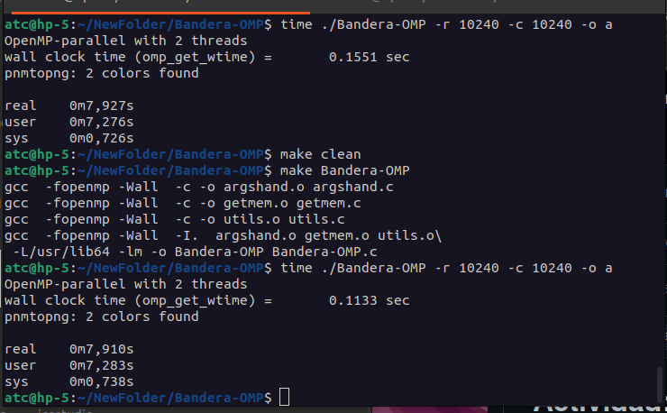
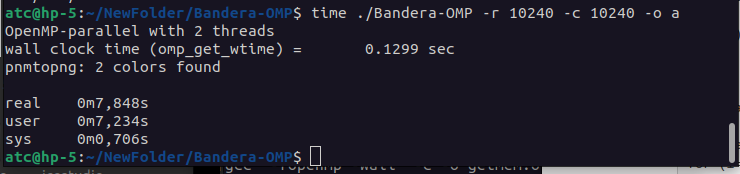
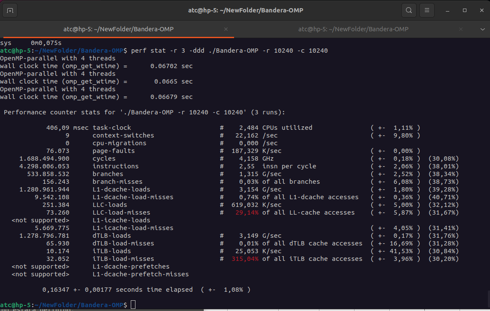
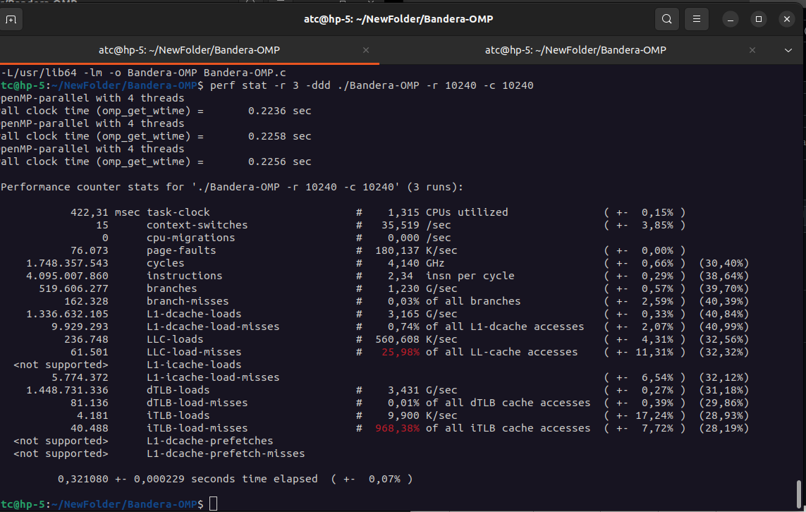

# Ejercicio: Bandera OMP.

# A rellenar por el alumno/grupo
## Nombre y apellidos alumno 1   : < Franco Sergio Pereyra >
## Nombre y apellidos alumno 2   : < Rosa Maria Lopez Garcia>
## Nombre y apellidos alumno 3   : < David Matarin Guill>
## Mayoría en GTA1, GTA2 o GTA3  : < GT2 >
## Nombre de grupo de actividades: < GT2-2 y GT3-2 >


# Descripción de la arquitectura utilizada:
## Arquitectura: 
  * Microprocesador: Intel core I5-10500 CPU @ 3.10GHz
  * Número de núcleos: 6
  * Cantidad de subprocesos por nucleo: 12
  * Tiene hyperthreading (SMT) activado en BIOS:Si
  * HDD/SDD: 500G
  * RAM:16G
  * Se usa máquina virtual: NO
    - Número de cores:
    - RAM: 
    - Capacidad HDD: 

## Instrucciones:

El ejemplo muestra como generar una imagen RGB de la bandera de España.

Los parámetros de anchura y altura se introducen por la línea de comandos.

La memoria se asigna de forma dinámica. Aunque se podría escribir directamente en el fichero de salida, se usan tres matrices (R, G y B) para generar los colores RGB de cada pixel.

Se pedirá al alumno que *decore* el programa con directivas OpenMP de forma que los colores ppRed, ppGren y ppBlue de cada pixel puedan calcularse en paralelo con varias hebras. 

El programa podrá ejecutarse en 
  * secuencial al compilarse con gcc  y 
  * en paralelo, al compilarse con gcc -fopenmp y distinto número de hebras.

En el makefile ya se ha puesto el flag OMP. 

Como tamaño de la bandera, se usarán los indicados en las tablas de la entrega. Se puede cambiar el Run.sh para todas las versiones paralelas.

Hay que comparar los tiempos obtenidos con distinto número de hebras y con la versión secuencial.

Según los [consejos/trucos/gotchas](https://www.archer.ac.uk/training/course-material/2017/08/openmp-ox/) de EPCC:
  * En las regiones paralelas 
    - usad siempre **default(none)** y usad **private**, **share**, ... para las variables.
    - Es mejor que las variables sean locales a la región paralela.

### A tener en cuenta:
  * En el Run.sh hay que poner todas las ejecuciones con y sin salida gráfica.
  * Cuando se miden tiempos hay que quitar el PRINT=1 y poner PRINT=0, ya que la salida por pantalla consume mucho tiempo.
  * Si se usa portátil, hay medir tiempos con el portátil enchufado a la corriente ya que si no los cores reducen su rendimiento.
  * Si se miden tiempos hay que compilar sin el -g ni el -pg.
  * Hay que tener en cuanta la opción -o España. Es decir con y sin salida gráfica.
	- $Bandera-OMP -r 200 -c 300 -o España (genera España.png)
	- $Bandera-OMP -r 200 -c 300     (no genera España.png)
  * No se realizan dos ficheros fuentes con el código secuencial y el paralelo. Es el mismo fichero para la versión secuencial y paralela haciendo uso de #ifdef _OPENMP e #ifndef _OPENMP.
  * Al compilar no debe haber warnings.
  * La memoria consumida dependerá del tamaño de la imagen y el tipo de datos a almacenar por pixel. Hay que calcularla.
  * Hay que responder a las preguntas y argumentar los resultados.


## Librerias
Se necesita tener instalados los siguientes paquetes:
  * netpbm-progs (o netpbm) para los comandos del sistema rawtoppm y rawtopng.
  * eog para visualizar la imagen.
  * Normalmente, los comandos OpenMP no están en las man. Hay que instalarlos. Ver como en [OpenMP-man-pages](https://github.com/Shashank-Shet/OpenMP-man-pages).


## Objetivos
 * Familiarizar al alumno con 
    - El uso de OpenMP sobre bucles for. 
 * Como medir el tiempo consumido. 
    - Para el tiempo total se usará la parte real del comando ```$ time programa < parámetros > ``` en la consola. 
    - Para el tiempo consumido de alguna parte del programa: 
        + En secuencial: gettimeoftheday().
        + En paralelo omp_get_wtime(). Hay un ejemplo en OpenMP/solution/pi/pi2.c al descomprimir OpenMPsingle.tar.gz.

- - - 
## Compilación

```console 
$ make 
```

## Ayuda parámetros 
```console
$ ./Bandera-OMP -h
```

## Ejemplo de compilacion, establecer parámetros  y ejecución
 * En el script Run.sh
 * Ver las variables de entorno para OpenMP.

- - -

# Entrega:

## Speed-up Teórico:

1. **Describe la formula del speed-up o ganancia de velocidad teórica usando la ley de Amdahl (SpA), en términos del porcentaje del código secuencial a paralelizar y del porcentaje del código secuencial que no se va ha paralelizar.**

 * Para calcular SpA(p) solo se miden tiempos del programa secuencial.
 * SpA(p)= 1/(%T.CsPar/p+%T.CsnPar)
 * p = número de elementos de proceso.
 * Se miden en secuencial dentro del código (con gettimeofday()):
    - T.CsPar: Tiempo del código secuencial a paralelizar.
    - T.CsnPar: Tiempo del código secuencial que no se va ha paralelizar.
 * Se miden con la parte real de ```$ time programa < parámetros >  ```
    - T.Sec: Tiempo total del programa secuencial.
 * T.CsnPar = T.Sec - T.CsPar.
 * %T.CsPar = T.CsPar/T.Sec.
 * %T.CsnPar = T.CsnPar/T.Sec.

2. **¿Cuanto es el valor de SpA(p) si p=1?**

 * 1.02
 
3. **¿Cuanto es el valor de SpA(p) si todo el código no es paralelizable?**

 * 1.0

4. **¿Cuanto es el valor de SpA(p) si se puede paralelizar todo el código?**

 * Hay que elegir un número de filas y columnas (Rows=Col) múltiplo de 1024 (n*1204, n>1) que haga que el programa secuencial tarde varios segundos y que no consuma toda la RAM.
 * Cada pixel necesita tres bytes, uno para cada color.
 * 1 kB =1024 bytes.
 
 * Teoricamente, si todo el programa es paralelizable el speedup seria infinito

5. **¿Que valor de Rows=Col has elegido? ¿Cuanta memoria (Mem.) ocupa la imagen?** 

 * Hemos escogido 1024 y la imagen ocupa 423 bytes
 
6. **Rellena la siguiente tabla para la versión secuencial sin salida gráfica.**

 * Hay que compilar sin -fopenmp (en el makefile). _OPENMP no estará definido.
 * Ejemplo de ejecución
```console 
$ time Bandera-OMP -r Rows -c Cols
```

* T.CsPar:
* El tiempo del código secuencial que será paralelizado: relleno de las matrices ppRed, ppGreen y ppBlue. Ya está en  el código la medición del tiempo secuencial que se tarda en la parte del código a paralelizar (bucles que establecen los colores de la bandera) de forma interna en el programa secuencial.

* Se adjunta una hoja de cálculo para calcular SpA() y Sp(). Hay que rellenar los campos T.Sec, T.CsPar, T(p) y p. Se visualiza ejecutando:

```console 
$ localc Speed-up.ods
```


| Ejecución   | -r 1024 -r 1024 |-r Rows (10240) -c Cols (10240)| 
| ----------- | --------------- | ------------------------------|
| Mem.        |423bytes         |   23.45k                      |
|T.Sec        |0.020            |   0.319                       |
|T.CsPar      |0.0125           |   0.212                       |
|SpA(2)       |1.4249           |   1.500068                    |
|SpA(4)       |1.078            |   2.00018                     |


## Speed-up real Sp(p): 

7. **Describe la formula de la ganancia en velocidad o speed-up real, describiendo los términos utilizados.**
 
 * Sp(p)=T.Sec/T(p)
 * Donde:
    - T(p) : Tiempo total del programa paralelo con p elementos de proceso.

8. **Describe qué realiza el schedule(static) y qué chunk usa por defecto.**

  * int chunk_size = total_iterations / num_threads; // Tamaño del chunk
  
9. **Rellena la siguiente tabla para la versión paralela. Se usará schedule(static) sin establecer el chunk.** 

 * Incluir el código OMP (decorar el código). Ver **//TODO**.
 * Hay que compilar con -fopenmp (en el makefile). _OPENMP estará definido.
 * Hay que establecer la variable de entorno con el número de hebras. Por ejemplo, para p=4 sería:
```console
$ export OMP_NUM_THREADS=4 
```
 * Al compilarse con -fopenmp, no se mide internamente el tiempo del código secuencial a paralelizar. Solo se mide si _OPENMP no está definido.


| Ejecución   |-r 1024 -r 1024 |-r 10240 -c 10240| 
| ----------- | -------------- | --------------- |
|T(2)         |  0.011         | 0.225           |
|T(4)         |  0.06          | 0.224           |
|Sp(2)        |  0.81          | 1.36            |
|Sp(4)        |  1.5           | 1.36            |


10. **¿Es el SpA(p) distinto del SP(p)? ¿Porqué?**
  
  * Si
  
11. **Teóricamente, ¿Mejoraría el Sp() si se establece el tamaño del chunk en el  schedule(static,chunk)? ¿Y si se usa otro scheduler?**

* Si, con un chunk de 20 mejoraria de 0.15 a 0.11
  


* Con dynamic:
  


12. **¿Qué hace el collapse(2) en la directiva OMP?**

 * collapse(2) se utiliza para combinar dos bucles anidados en un solo nivel de paralelismo. Esto permite que el compilador o el entorno de ejecución utilice mejor los recursos del sistema, aumentando la cantidad de hilos que se pueden utilizar en la ejecución paralela.

13. **Rellena la siguiente tabla para la versión paralela con schedule(static) y collapse(2)**

| Ejecución   |-r 1024 -r 1024 |-r 10240 -c 10240  | 
| ----------- | -------------- | ----------------- |
|T(2)         | 0.006          |  0.207            |
|T(4)         | 0.008          |  0.162            |
|Sp(2)        | 1.5            |  1.458            |
|Sp(4)        | 1.125          |  1.86             |

**14. ¿Mejora el Sp(p)? ¿Porqué?**
 * Incluye y compara la salida de los rendimientos ( ```$ perf stat -r 3 -ddd programa < parámetros >``` usando o no collapse (2). 

* Con colapse:  



* sin colapse:



## Experimentos con salida gráfica (-o España): 

15. **Rellena la siguiente tabla para la ejecución secuencial con salida gráfica.**
 * Hay que compilar sin -fopenmp (en el makefile). _OPENMP no estará definido.
 * Ejemplo de ejecución (Rows=Cols se establecieron en el punto 5):
```console 
$ time Bandera-OMP -r Rows -c Cols -o España
```
               
| Ejecución   | -r 1024 -r 1024 |-r Rows -c Cols | 
| ----------- | --------------- | -------------- |
| Mem.        | 423bytes        |  23.45         |
|T.Sec        |  0.085          |  7.905         |
|T.CsPar      | 0.0116          |  0.2238        |
|SpA(2)       | 1.073           | 1.013          |
|SpA(4)       | 1.11            | 1.019          |


16. **Rellena la siguiente tabla para la ejecución paralela con salida gráfica, con schedure(static) y sin collapse().**

| Ejecución   |-r 1024 -r 1024 |-r Rows -c Cols  | 
| ----------- | -------------- | --------------- |
|T(2)         |  0.115         | 8.070           |
|T(4)         |  0.115         | 7.950           |
|Sp(2)        |  0.739         | 0.994           |
|Sp(4)        |  0.739         | 0.979           |


16. **¿Porqué ahora el SpA() y Sp(p) son peores que en la tablas 6 y 9?** 
* Responde usando como argumentos los porcentajes de código paralelizable y no paralelizable.


17. **¿Porque SpA(p) y Sp(p) no mejoran sustancialmente al aumentar el tamaño de la imagen?**


18. **¿Has hecho un *make clean* y borrado todas los ficheros innecesarios (imágenes, etc) para la entrega antes de comprimir?**

* si

- - - 

### Como ver este .md 
En linux instalar grip:

```console 
$ pip install grip 
```

y ejecutar
```console
$ grip -b README.md
```

### Markdown cheat sheet

Para añadir información a este README.md:

[Markdown cheat sheet](https://www.markdownguide.org/cheat-sheet/)

- - -

&copy; [Leocadio González Casado](https://sites.google.com/ual.es/leo). Dpto, Informática, UAL.
