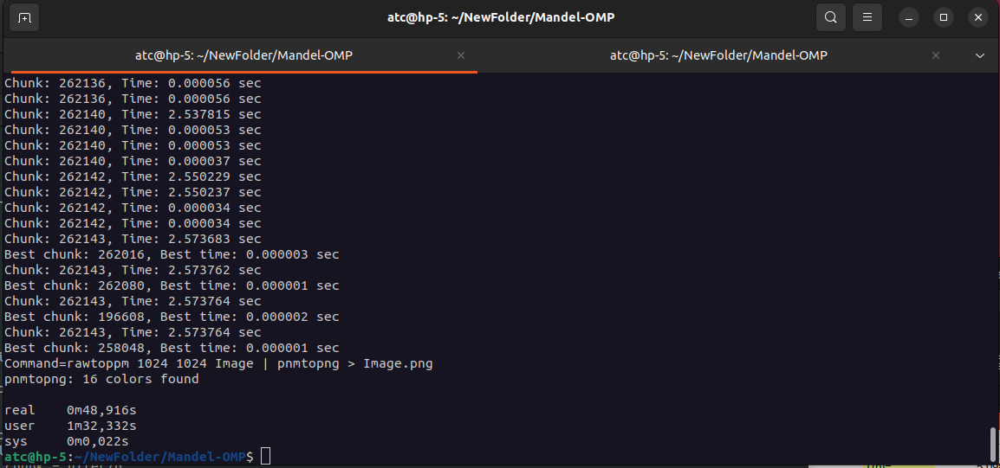

# Ejercicio: Mandel OMP

# A rellenar por el alumno/grupo
## Nombre y apellidos alumno 1   : < Franco Sergio Pereyra >
## Nombre y apellidos alumno 2   : < Rosa Maria Lopez Garcia >
## Nombre y apellidos alumno 3   : < David Matarin Guill >
## Mayoría en GTA1, GTA2 o GTA3  : < GT2 >
## Nombre de grupo de actividades: < .... >

# Descripción de la arquitectura utilizada:
## Arquitectura: 
 * Microprocesador: Intel core I5-10500 CPU @ 3.10GHz
 * Número de núcleos: 6
 * Cantidad de subprocesos por nucleo: 12
 * Tiene hyperthreading (SMT) activado en BIOS:Si
 * HDD/SDD: 500G
 * RAM:16G
  * Se usa máquina virtual:
    - Número de cores:
    - RAM: 
    - Capacidad HDD: 

# Instrucciones

El ejemplo muestra como generar una imagen en color del fractal de Mandelbrot.

> Información del fractal de Mandelbrot en la [wiki](https://es.wikipedia.org/wiki/Conjunto_de_Mandelbrot). 
>
> Mandelbrot set [Rosetta code](https://rosettacode.org/wiki/Mandelbrot_set#C)
>
> Mandelbrot set  [Techniques for computer generated pictures](https://www.math.univ-toulouse.fr/~cheritat/wiki-draw/index.php/Mandelbrot_set) 

El fractal de Mandelbrot es en blanco y negro aunque se pueden generar tonos de gris o colores dependiendo del número de iteraciones "NIter" que se realicen sobre cada punto (pixel). El número de iteraciones en cada pixel es normalmente diferente porlo que se necesita balanceo dinámico e la carga para obtener buenos speed-ups.

Se proporciona el código que genera el fractal de Mandelbrot en color usando la rutina NIterToRGB(). 

Se pedirá al alumno que *decore* el programa con directivas OpenMP para obtener una versión paralela (gcc -fopenmp). Debe poder compilarse también en serie (gcc) sin warnnings. 

Los parámetros se introducen por la línea de comandos.

La memoria se asigna de forma dinámica. 
Aunque se podría escribir directamente en el fichero de salida, se usan:
  *  Tres matrices (R, G y B) para generar los colores RGB de cada pixel.


### A tener en cuenta:
  * En el Run.sh se encuentran las distintas ejecuciones paralelas con -mi 1e4 y -mi 1e5, y con distinto número de hebras, no la secuencial.
  * Cuando se miden tiempos hay que quitar el PRINT=1 y poner PRINT=0 ya que la salida por pantalla consume mucho tiempo.
  * Si se usa portátil, medir tiempos con el portátil enchufado a la corriente ya que si no os cores reducen su rendimiento.
  * Si se miden tiempos hay que compilar sin el -g ni el -pg.
  * No se realizan dos ficheros con el código secuencial y el paralelo. Es el mismo fichero para la versión secuencial y paralela, compilando o no con -fopenmp y haciendo uso de #ifdef _OPENMP y/o #ifndef _OPENMP.
  * Al compilar no debe haber warnings.
  * Hay que responder a las preguntas y argumentar los resultados.
  * Para el calculo de la ganancia de velocidad real (speed-up) Sp(p) se usará el tiempo real devuelto por $time Mandel-OMP .....
  * En el programa secuencial ( compilado sin -fopenmp) ya se mide el tiempo del código secualcial aparalelizar. El tiempo total del programa, serie o paralelo, se obtiene con la parte read de ```$ time .Mandel-OMP ...```. 
  * El parámetro -mi indica el número máximo de iteraciones a realizar en un pixel. Habrá pixeles en los que se llegue a ese máximo y otros en los que no. Por eso el trabajo en cada pixel no es estático, es variable. Esto requerirá de algún tipo de balanceo de la carga entre hebras. 

## Librerias
Se necesita tener instalados los siguientes paquetes:
  * netpbm-progs (o netpbm) para los comandos del sistema rawtoppm y rawtopng.
  * eog para visualizar la imagen.
  * Los comandos OpenMP no están en las man. Hay que instalarlos. Ver como en [OpenMP-man-pages](https://github.com/Shashank-Shet/OpenMP-man-pages).

## Objetivos
 * El uso de OpenMP sobre bucles for y el uso de distintos *schedule* y como establecer el *chunk*.
 * Cómo medir el tiempo consumido de CPU y wall clock time.
 * Optimizar algoritmos paralelos en OMP para problemas donde la cantidad de trabajo computacional a realizar por cada tarea no es el mismo.

## Compilación

```console 
$ make 
```

## Ayuda parámetros 
```console
$ ./Mandel -h
```

## Ejemplo de compilacion y ejecución
	En el script Run.sh

- - -

# Entrega:

## Speed-up Teórico:

1. **Rellena la siguiente tabla para la versión secuencial.**
 * Memoria: Es la memoria consumida por ppRed, ppGreen y ppBlue y otros datos usados.
 * T.Sec: El wall-clock time del programa secuencial. Parte real del ```$ time Mandel-OMP ...```.
 * T.CsPar: El tiempo del código secuencial que será paralelizado. 
 * SpA(p): El spedd-up **teórico** según la ley de Amhdal para p hebras paralelas.
 * Se adjunta una hoja de cálculo para calcular SpA() y Sp(). Hay que rellenar los campos T.Sec, T.CsPar, T(p) y p. Se visualiza ejecutando:

```console 
$ localc Speed-up.ods
```

| Ejecución   | -mi 1e4         | -mi 1e5         |
| ----------- | --------------- | --------------- | 
| Memoria(Gb) |  0.0000036 G    | 0.000036 GB.    |
|T.Sec        |  5.047          | 50.239          |
|T.CsPar      |  4.955          | 50.132          |
|SpA(2)       |  1.96           | 1.99            |
|SpA(4)       |  3.79           | 3.97            |


2. **¿Porqué ahora la salida gráfica no es tan influyente en SpA() como en la actividad Bandera-OMP?** 
 * Contesta teniendo en cuenta los porcentajes de código paralelizado y no paralelizado.
 
* En términos del porcentaje de código paralelizado, el cálculo de cada píxel del conjunto de Mandelbrot es fácilmente paralelizable y constituye la mayor parte del tiempo de ejecución. Por otro lado, la salida gráfica (escribir la imagen en disco) es una tarea más pequeña en comparación y probablemente no está paralelizada, lo que limita su impacto en la métrica de aceleración (SpA). En la actividad de Bandera-OMP, quizás la salida gráfica tenía un impacto mayor en el cómputo total.

## Speed-up real Sp(p): 

La opción **-o** genera la imagen, que debe ser correcta al visualizarse con el comando *eog* al usar hebras.

3. **Describe que realiza el schedule(static) y qué chunk usa por defecto.**

* El schedule(static) distribuye las iteraciones del bucle entre los hilos de forma equitativa en bloques o chunks fijos. Por defecto, sin especificar el tamaño del chunk, el tamaño es calculado automáticamente como el número total de iteraciones dividido por el número de hilos.

Por ejemplo:

    * Si tienes 4 hilos y 100 iteraciones, cada hilo recibe 25 iteraciones de manera estática.
    * No hay intercambio dinámico de tareas entre los hilos; una vez que un hilo recibe su conjunto de iteraciones, las ejecuta todas antes de finalizar.
    
4. **Rellena la siguiente tabla. Para la parte paralela se usará schedule(static) sin establecer el chunk.** 

 * T(p): Wall clock time del programa paralelo con p hebras.
 * Sp(p): ganancia en velocidad con p hebras.

| Ejecución   | -mi 1e4         | -mi 1e5         |
| ----------- | --------------- | --------------- | 
|T(1)         |  4.953          | 50.013          | 
|T(2)         |  2.675          | 25.324          | 
|T(4)         |  2.654          | 25.324          | 
|Sp(1)        |  1.01           | 1.0045          | 
|Sp(2)        |  1.88           | 1.98            | 
|Sp(4)        |  1.90           | 1.98            | 

5. **¿Hay diferencias entre T.Sec y T(1)?**
 * Ver el número de hebras se usan realmente en T(1). Hay más recursos? 
 
* T(1) no es exactamente igual a T.Sec debido a la inicialización y administración de los recursos por parte de OpenMP, lo cual introduce un pequeño overhead adicional.
* Recursos adicionales: Es posible que el compilador, al habilitar OpenMP, optimice de manera diferente o utilice recursos del sistema de forma más eficiente (incluso con una sola hebra), lo que podría resultar en un pequeño aumento en el rendimiento.

6. **¿Porqué no mejora sustancialmente el Sp(4) respecto al Sp(2)?**
 * Ver la imagen generada. A cuantas hebras le ha tocado casi todo el trabajo para p=2 y p=4? 
*  Cuando se usa p=2, es probable que 2 hilos estén asumiendo casi todo el trabajo en paralelo, lo que significa que la carga de cada hilo podría ser muy diferente. En p=4, si la carga se distribuye bien, cada hilo debería recibir menos trabajo, pero si el problema no se paraleliza de manera efectiva, es posible que no se observe una mejora significativa en el speedup

7. **Describe que realiza el schedule(dynamic) y que chunk usa por defecto.**
 * schedule(dynamic) permite que los hilos tomen iteraciones de forma dinámica, mejorando la carga de trabajo entre hilos, especialmente en escenarios donde las iteraciones tienen diferentes tiempos de ejecución.
El tamaño de chunk por defecto es 1, lo que significa que los hilos trabajan en una sola iteración a la vez antes de solicitar otra.

8. **Rellena la siguiente tabla. Para la parte paralela se usará schedule(dynamic) sin establecer el chunk.**

| Ejecución   | -mi 1e4         | -mi 1e5         |
| ----------- | --------------- | --------------- | 
|T(1)         | 4.953           | 50.013          | 
|T(2)         | 2.662           | 25.455          | 
|T(4)         | 1.365           | 13.066          | 
|Sp(1)        | 1.01            | 1.0045          | 
|Sp(2)        | 1.895           |  1.973          | 
|Sp(4)        | 3.697           |  3.845          | 


9. **Describe que realiza el schedule(guided) y que chunk usa por defecto.**
* schedule(guided) permite una distribución de carga más equilibrada a lo largo de la ejecución del bucle, comenzando con una cantidad mayor de iteraciones y disminuyendo gradualmente.
El tamaño de chunk por defecto varía, pero es aproximadamente el total de trabajo dividido por el número de hilos, reduciéndose a medida que se completa el trabajo.

10. **Rellena la siguiente tabla. Para la parte paralela se usará schedule(guided) sin establecer el chunk.**

| Ejecución   | -mi 1e4         | -mi 1e5         |
| ----------- | --------------- | --------------- | 
|T(1)         | 0.621           |  5.098          | 
|T(2)         | 0.382           |  2.658          | 
|T(4)         | 0.373           |  2.908          | 
|Sp(1)        | 8.127           |  9.854          | 
|Sp(2)        | 12.964          |  18.901         | 
|Sp(4)        | 13.530          |  17.276         | 


11. **¿Qué scheduler se comporta mejor para -mi 1e5? ¿Porqué?**
* El schedule(guided) se comporta mejor para -mi 1e5 porque logra una reducción significativa en el tiempo de ejecución y un aumento notable en la ganancia de velocidad (speedup). Esto se debe a su capacidad para adaptarse a la carga de trabajo variable de las iteraciones y a una distribución de las tareas más eficiente, lo que permite un mejor aprovechamiento de los recursos del sistema en comparación con los otros dos métodos.

12. **¿Cual es el mejor chunk para el scheduler dynamic y -mi 1e5?**
* Hay que hacer una búsqueda dicotómica del mejor chunk.
* nIter= número de iteraciones totales a paralelizar.
* Se obtiene T(p).max con el chunk max = máximo chunk = nIter/p
* Se obtiene T(p).min con el chunk min = mínimo chunk = 1.
* Repetir
    - Se obtiene T(p).med con el chunk med = (max - min)/2
    - Si T(p).min < T(p).max
       + max=med
    - Si no min=med
* hasta que T(p).min sea similar a T(p).max

* 262143 con 2.573764s a 4 hilos



13. **Rellena la siguiente tabla para el scheduler y chunk del punto anterior.**

| Ejecución   | -mi 1e5         |
| ----------- | --------------- |
|Chuck p=2    | 262144          |
|Chunk p=4    | 262143          | 
|T(2)         | 2.541           |
|T(4)         | 2.573           | 
|Sp(2)        | 19.77           |
|Sp(4)        | 19.52           |

14. **Explica el porqué de los resultados usando chunk y sin usarlo.**

* Al especificar un chunk (especialmente en schedule(dynamic), se logra un balance de carga más eficiente. Los hilos toman porciones de trabajo que se ajustan a su capacidad actual, lo que puede reducir el tiempo total de ejecución y mejorar el speedup. En este  caso, los resultados muestran que el uso de un chunk optimizado permite un mejor aprovechamiento de los recursos, mejorando la eficiencia general del programa.

15. **¿Has hecho un *make clean* y borrado todas los ficheros innecesarios (imágenes, etc) para la entrega antes de comprimir?**

* Si

- - - 

### Como ver este .md 
En linux instalar grip:

```console 
$ pip install grip 
```

y ejecutar
```console
$ grip -b README.md
```

- - -

&copy; [Leocadio González Casado](https://sites.google.com/ual.es/leo). Dpto. Informática, UAL.
