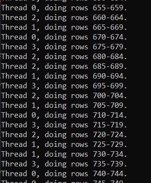
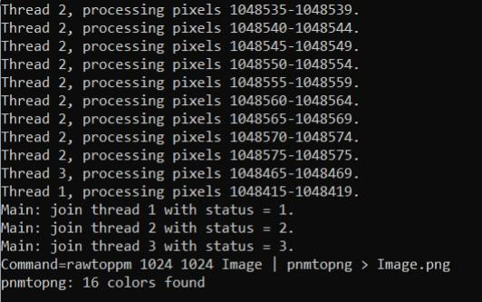

# Ejercicio: Mandel PTh.

# A rellenar por el alumno/grupo
## Nombre y apellidos alumno 1   : < Franco Sergio Pereyra >
## Nombre y apellidos alumno 2   : < Rosa Maria Lopez Garcia>
## Nombre y apellidos alumno 3   : < David Matarin Guill>
## Mayoría en GTA1, GTA2 o GTA3  : < GT2 >
## Nombre de grupo de actividades: < GT2-2 y GT3-2 >


# Descripción de la arquitectura utilizada:
## Arquitectura: 
  * Microprocesador: Intel core I5-10500 CPU @ 3.10GHz
  * Número de núcleos: 6
  * Cantidad de subprocesos por nucleo: 12
  * Tiene hyperthreading (SMT) activado en BIOS:Si
  * HDD/SDD: 500G
  * RAM:16G
  * Se usa máquina virtual: NO
    - Número de cores:
    - RAM: 
    - Capacidad HDD:
      
## Instrucciones:

* El Mandel.c muestra como generar una imagen en color del fractal de Mandelbrot.
> Información del fractal de Mandelbrot en la [wiki](https://es.wikipedia.org/wiki/Conjunto_de_Mandelbrot). 
>
> Mandelbrot set [Rosetta code](https://rosettacode.org/wiki/Mandelbrot_set#C)
>
> Mandelbrot set  [Techniques for computer generated pictures](https://www.math.univ-toulouse.fr/~cheritat/wiki-draw/index.php/Mandelbrot_set) 
* El fractal de Mandelbrot es en blanco y negro aunque se pueden generar tonos de gris o colores dependiendo del número de iteraciones "NIter" que se realicen sobre cada punto (pixel).
* Se proporciona el código que genera el fractal de mandelbrot en color usando la rutina NIterToRGB(). 
* Los parámetros se introducen por la línea de comandos.
* La memoria se asigna de forma dinámica. Aunque se podría escribir directamente en el fichero de salida. Se usan:
    +  Tres matrices (R, G y B) para generar los colores RGB de cada pixel.
 * En el Run.sh se tienen los comandos a ejecutar para -mi 1e4 y -mi 1e5 para el algoritmo secuencial (Mandel) y el paralelo (Mandel-PTh) con distinto número de hebras.
    - La versión secuencial se usará para obtener T.Sec y T.CsPar.
    - La versión paralela con p hebras se usará para obtener T(p).
 * En la versión paralela se ha añadido las opciones:
    + -cs < chunck size > por defecto 1.
    + -nt < número de hebras > 
 * La opción **-o** genera la imagen. La imagen se debe usar para verificar que el código es correcto, al visualizarse la imagen con el comando *eog*.
 * Se requiere completar el Mandel-PTh. Ver **//TODO** en el código.
 * Las hebras en Mandel-PTh trabajan por filas completas. Cada hebra trabajará en un número ChunkSize de filas indicado en la opción -cs (chunk size), que por defecto es de una fila cada vez.
 * De Mandel OMP sabemos que una distribución estática, donde cada hebra realiza Rows/NThreads filas, no es lo más eficiente debido a la distinta carga computacional por pixel y por tanto también por filas. Por otro lado, con -cs 1, donde cada hebra realiza una fila cada vez, las hebras tienen más probabilidad de esperar en el mutex para saber en qué fila comienzan la nueva ejecución, que si se usaran valores mayores de ChunkSize.
 * Cuando se midan tiempos PRINT=0 y DEGUD=0.

## Librerías
Se necesita tener instalados los siguientes paquetes:
  * netpbm-progs (o netpbm) para los comandos del sistema rawtoppm y rawtopng.
  * eog para visualizar la imagen.

## Objetivos
 * Familiarizar al alumno con 
	- El uso de PThreads.
 * Usar balanceo de la carga variando tamaño de chunck para problemas con diferente carga computacional por iteración.
 * Familiarizarse con el uso de exclusión mutua al modificar variables compartidas entre hebras (siguiente fila a computar).
  * Cómo medir el tiempo consumido de CPU, Wall-clock-time y el speed-up.

## Compilación

```console 
$ make -j
$ make -j Mandel
$ make -j Mandel-PTh
$ make -j all
```

## Ayuda parámetros 
```console
$ ./Mandel -h
$ ./Mandel-PTh -h
```

## Ejemplo de compilacion y ejecución
	En el script Run.sh

- - -

# Entrega:

## Speed-up teórico

1. **Rellena la siguiente tabla para la versión secuencial, Mandel.c.**


| Ejecución   | -mi 1e4         | -mi 1e5           |
| ----------- | --------------- | ----------------- |
|T.Sec        |  5.075          |   51.180          |
|T.CsPar      |  4.956          |   51.078          |
|SpA(2)       |  1.954          |   1.996           |
|SpA(4)       |  3.738          |   3.9762          |

donde
 * T.Sec: El wall-clock time (tiempo total) del programa secuencial. Parte real del $time Mandel ... 
 * T.CsPar: El tiempo de la parte del código secuencial que será paralelizado: doble bucle.
 * SpA(p): El spedd-up **teórico** según la ley de Amhdal para p hebras paralelas.


## Speed-up real Sp(p): 
 * Para las siguientes tablas, todo se mide para el algoritmo paralelo Mandel-PTh.c. T.Sec es el obtenido en el punto 1.
 * T(p): Wall clock time del programa paralelo con p hebras.
 * Sp(p): ganancia en velocidad con p hebras.

2. **Con -cs 1. Es el valor por defecto.**

| Ejecución   | -mi 1e4         | -mi 1e5         |
| ----------- | --------------- | --------------- | 
|T.Sec        |  5.075          |   51.180        | 
|T(1)         |  5.044          |   49.344        |
|T(2)         |  2.638          |   25.237        | 
|T(4)         |  1.390          |   12.981        | 
|Sp(1)        |  1.006          |   1.037         | 
|Sp(2)        |  1.923          |   2.027         | 
|Sp(4)        |  3.651              3.942         |

3. **Con -cs Rows/(p=NThreads). Distribución estática.**

| Ejecución   | -mi 1e4         | -mi 1e5         |
| ----------- | --------------- | --------------- | 
|T.Sec        |  5.075          |   51.180        | 
|Chuck p=2    |  512            |   512           |
|Chunk p=4    |  256            |   256           |
|T(2)         |  2.666          |   25.402        | 
|T(4)         |  1.406          |   13.013        | 
|Sp(2)        |  1.903          |   2.010         | 
|Sp(4)        |  3.609          |   3.925         |


4. **Con el mejor valor encontrado para -cs.**
* Hay que hacer una búsqueda dicotómica del mejor chunk.
* Rows = número de filas totales a paralelizar.
* Se obtiene T(p).max con el chunk max = máximo chunk = Rows/p
* Se obtiene T(p).min con el chunk min = mínimo chunk = 1.
* Repetir
    - Se obtiene T(p).med con el chunk med = (max - min)/2
    - Si T(p).min < T(p).max
       + max=med
    - Si no 
       + min=med
* hasta que T(p).min sea similar a T(p).max o min=max+1.
* Resultado: Chunck= min o max que tenga menor valor de T(p).Chunk.

**Resumiendo**
Se continua en el intervalo [min-cs,med-cs] o [med-cs,max-cs] que tenga mejores tiempos 
T.(min-cs), T.(med-cs) o T.(max-cs). 

* **Ejemplo inventado**
1. First Iteration:
* min-cs  =   1, T.(min-cs) = 10 s.
* max-cs  = 128, T.(max-cs) = 20 s.
* cs-med  =  64, T.(cs.med) =  9 s.
* Entonces, max-cs=cs-med=64 and T.(max-cs)=T.(cs-med)=9
2. Second Iteration
* min-cs  =  1,  T.(min-cs) = 10 s.
* max-cs  = 64,  T.(cs.max) =  9 s.
* cs-med  = 32,  T.(cs-med) =  7 s.
* Entonces, min-cs=cs-med=32 and T.(min-cs)=T.(cs-med)=7.
3. Third iteration
* min-cs  = 32,  T.(min-cs) =  7 s.
* max-cs  = 64,  T(cs.max)  =  9 s.
* cs.med  = 48 ... </p>


De todas formas, si uan hebra hace una fila entera, el mejor valor del chunk ( -cs ) se encuentra en el intervalo [1,32]. Búscalo.

**¿Por qué calcular el mejor chunk?**
* Con cs=1 el número de filas a repartir entre subprocesos = 1024. Determinar la fila y el subproceso consume tiempo.
* Con cs=Rows/p el número de repartos es el más pequeño pero habrá desbalanceo de la carga computacional.
* Por lo tanto, hay que encontrar un equilibrio entre ambos.


| Ejecución   | -mi 1e5         |
| ----------- | --------------- | 
|T.Sec        |   51.180        | 
|Chuck p=2    |   126           |
|Chunk p=4    |   5             |
|T(2)         |  25.022         | 
|T(4)         |  12.523         | 
|Sp(2)        |  2.045          | 
|Sp(4)        |  4.036          | 


5. **Compara el mejor Sp(4) para -mi 1e5 de Mandel-OMP con schedule dynamic y el mejor chunk encontrado con Mandel-PTh del punto 4.**
 + **¿Cual es mejor?**

* El del Mandel-Pth
  
 + **¿Son los chunks OMP y PTh distintos (indica sus valores)?**

*En omp fue 262143(En este se tomo en cuenta el cols al hacer el chunk) y en PTh 5

6. **Indica al número de filas que realiza cada hebra para una ejecución con p=4 de la tabla en el punto 4.**
    - **¿Difieren los números de filas realizadas por cada hebra de una ejecución a otra? ¿Porqué?**
    
    
      * En principio, el número de filas realizadas por cada hebra puede diferir ligeramente en cada ejecución debido a las siguientes razones:

      * Desbalanceo por División Inexacta: Como 1024 no es divisible exactamente por 4 en chunks de tamaño 5, es posible que algunas hebras reciban un chunk adicional o una fila más, dependiendo de cómo se asignen los chunks en cada ejecución.

      * Variabilidad del Sistema y Balanceo de Carga: Si el sistema o el entorno de ejecución tiene variaciones de carga (por ejemplo, diferentes subprocesos compiten por recursos), algunos chunks pueden completarse en diferentes momentos, lo que afecta la asignación exacta en cada ejecución.
    
    
    - **¿Es el número de filas realizado por las hebras de una ejecución similar? ¿Porqué?**
      
      * Sí, el número de filas realizado por cada hebra tiende a ser similar en cada ejecución porque:

      * Distribución Equitativa de Chunks: El objetivo del algoritmo es repartir los chunks lo más equitativamente posible. En promedio, cada hebra debería manejar cerca de 256 filas si el chunk es de tamaño 5, aunque algunos podrían manejar 255 o 257 debido a la división inexacta.

      * Minimización de Desbalanceo: Al buscar un tamaño de chunk óptimo (en este caso, 5 para 
p=4), el sistema intenta minimizar el desbalanceo, de modo que todas las hebras terminen su trabajo aproximadamente al mismo tiempo.



7. **En vez de solo por filas, se podría haber paralelizado por pixeles. Teóricamente, ¿sería más efectivo? ¿Cuando y porqué?** 
* Para ello, el pixel donde empezar se numera de 0 a (Rows * Cols)-1. Para pasar de número de pixel a posición [i][[j] se puede usar la rutina VectorToMatrixInd() que se encuentra en el fichero Indexes-Vector-Matrix.c, y este en Rutines-PTh.tgz, que está en el aula virtual de la asignatura. Solo habría que usar VectorToMatrixInd() para el primer pixel del chunk, ya que los demás se pueden saber teniendo en cuenta Rows, Cols y el ChunkSize.

* Respuesta:
   * Para matrices grandes (más de varios cientos de filas y columnas).
En sistemas con muchos núcleos.
En cálculos no uniformes como Mandelbrot, donde algunos píxeles requieren muchas iteraciones y
Cuando el equilibrio de carga es importante para reducir el tiempo de inactividad de los hilos.
  * En conclusión, la paralelización por píxeles puede mejorar la eficiencia y balancear la carga de trabajo en entornos donde el procesamiento es intensivo y desigual, y donde se cuenta con una infraestructura de procesamiento capaz de manejar esta granularidad.



8. **¿Has hecho un *make clean* y borrado todas los ficheros innecesarios (imágenes, etc) para la entrega antes de comprimir?**

 * Si
- - -
### Cómo ver este .md 
En linux instalar grip:

```console 
$ pip install grip 
```

y ejecutar
```console
$ grip -b README.md
```

### Markdown cheat sheet

Para añadir información a este README.md:

[Markdown cheat sheet](https://www.markdownguide.org/cheat-sheet/)

- - -

&copy; [Leocadio González Casado](https://sites.google.com/ual.es/leo). Dpto, Informática, UAL.

