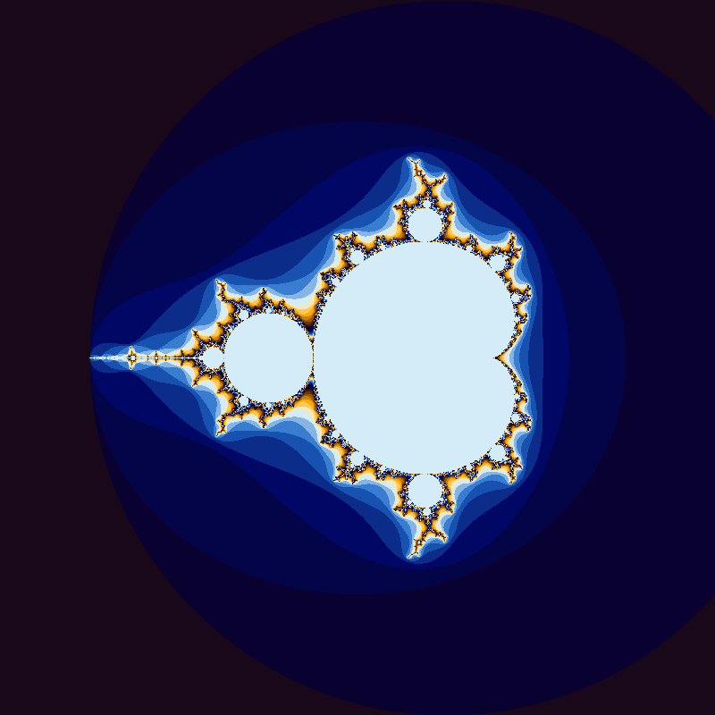
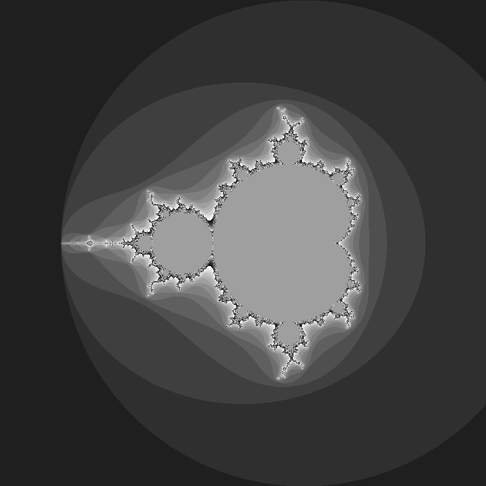

# Ejercicio: Mandelbrot serie

## A rellenar por el alumno
 * Nombre y apellidos alumno 1   : 
 * Nombre y apellidos alumno 2   : 
 * Nombre y apellidos alumno 3   : 
 * Mayoría en GTA1, GTA2 o GTA3  : 
 * Nombre de grupo de actividades: 

# Descripción de la arquitectura utilizada: 
 * Microprocesador:
 * Número de núcleos:
 * Cantidad de subprocesos por núcleo:
 * Tiene hyperthreading (SMT) activado en BIOS:
 * RAM:
 * Se usa máquina virtual:
    - Número de cores:
    - RAM: 
    - Capacidad HDD: 

## Instrucciones:
* El ejemplo muestra como generar una imagen en tonos de gris del fractal de Mandelbrot.

> Información del fractal de Mandelbrot en la [wiki](https://es.wikipedia.org/wiki/Conjunto_de_Mandelbrot). 
>
> Mandelbrot set [Rosetta code](https://rosettacode.org/wiki/Mandelbrot_set#C)
>
> Mandelbrot set  [Techniques for computer generated pictures](https://www.math.univ-toulouse.fr/~cheritat/wiki-draw/index.php/Mandelbrot_set) 

* El fractal de Mandelbrot es en blanco y negro aunque se pueden generar tonos de gris o colores dependiendo del número de iteraciones "NIter" que se realicen sobre cada punto (pixel).
* Se proporciona el código que genera el fractal de Mandelbrot en tonos de gris usando la rutina NIterToGray().
* El alumno debe ampliar el código para que que opcionalmente (sin el parámetro -g) se  genere la imagen en color RGB (ver las líneas comentadas con "**//TODO:**"). Se aporta la rutina NIterToRGB(), que usa una paleta de 16 colores RGB donde mapear el número de iteraciones sobre cada pixel para obtener el color RGB. 
* Los parámetros se introducen por la línea de comandos.
* La memoria se asigna de forma dinámica. 
Aunque se podría escribir directamente en el fichero de salida, se usan:
    - Una matriz Gray para los tonos de gris o
    - Tres matrices (R, G y B) para generar los colores RGB de cada pixel.

**Todas las variables necesarias ya están declaradas.**

## Librerias
Se necesita tener instalados los siguientes paquetes:
  * netpbm-progs (o netpbm) para los comandos del sistema rawtoppm y rawtopng.
  * eog para visualizar la imagen.

## Objetivos
  * Usar lo aprendido en el ejercicio Bandera.
  * Ejemplo secuencial donde el trabajo computacional de cada pixel (NIter) no se sabe de antemano.
  * Es un código secuencial candidato a necesitar balanceo dinámico de la carga en su paralelización.

## Compilación
```console 
$ make 
```

## Ayuda parámetros 
```console
$ ./Mandel -h
```

## Ejemplo de compilación y ejecuciones
 * En el script Run.sh
 * Un ejemplo de los posibles valores de los parámetros se encuentra en la Imagen del mes del portal de matemáticas de Enero de 2005.
    - [Pic of the month.](https://en.wikipedia.org/wiki/File:Mandelpart2.jpg)

- - - 
# Entrega:
 * Hay que entregar el fichero modificado. Ver las líneas comentadas con "//TODO:".

1. **¿Has verificado que la imagen se genera correctamente?**
   
la imagen en gris funciona perfectamente y el de color tambien




3. **¿Has verificado que no tienes perdida memoria?** 

si, al hacer valgrind tanto para gris como color, no surge perdidas de memoria


4.  **¿Has hecho un *make clean* y borrado todas los ficheros innecesarios (imágenes, etc) para la entrega antes de comprimir?**
   
Si

- - - 
### Como ver este .md 
En linux instalar grip:
```console 
$ pip install grip 
```
y ejecutar
```console
$ grip -b README.md
```

- - - 
### Markdown cheat sheet
Para añadir información a este README.md:
[Markdown cheat sheet](https://www.markdownguide.org/cheat-sheet/)

- - -
&copy; [Leocadio González Casado](https://sites.google.com/ual.es/leo). Dpto, Informática, UAL.
