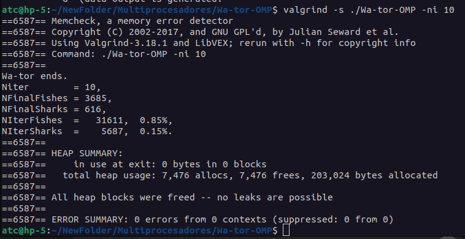
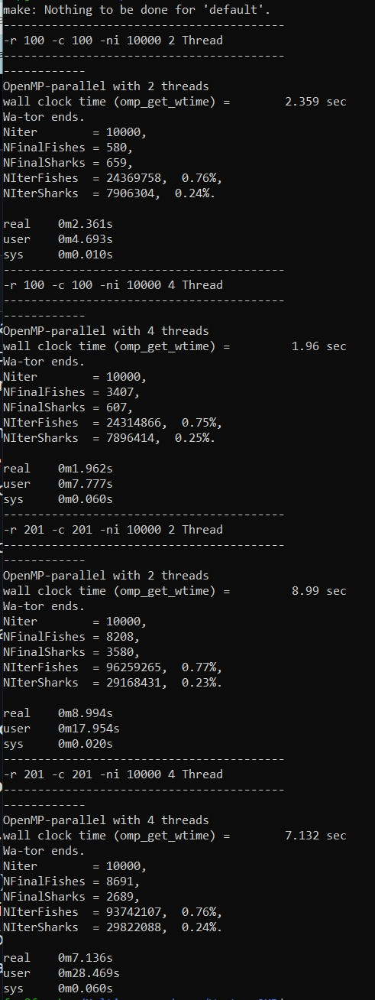

# Ejercicio: Wa-tor OMP.

# A rellenar por el alumno/grupo
* Nombre y apellidos alumno 1   : 
* Nombre y apellidos alumno 2   : 
* Nombre y apellidos alumno 3   : 
* Mayoría en GTA1, GTA2 o GTA3  : 
* Nombre de grupo de actividades: 

## Arquitectura: 
* Microprocesador:
* Número de núcleos:
* Cantidad de subprocesos por nucleo:
* Tiene hyperthreading (SMT) activado en BIOS:
* HDD/SDD: 
* RAM:
* Se usa máquina virtual:
    - Número de cores:
    - RAM: 
    - Capacidad HDD: 

# Instrucciones:
 * Buscar "TODO" en los ficheros:
```console 
$ grep -n TODO *
```
  * En el Run.sh se tienen los comandos a ejecutar para 
     + -r 102 -c 102 y -ni 10000 con distinto número de hebras y 
     + -r 201 -c 201 -ni 10000. 
  * Hay que asegurarse que el número de iteraciones final realizadas por el programa sean **10000**, es decir deben quedar peces y tiburones después de la ejecución para obtener tiempos.
  * Cuando se miden tiempos, no se usaran las salidas gráficas o de datos de gnuplot. Solo se usarán para chequear que el programa paralelo funciona como el secuencial. Hay que quitar el PRINT=1 y poner PRINT=0, ya que la salida por pantalla consume mucho tiempo. Hay que compilar sin el -g ni el -pg ya que no se está depurando ni haciendo un profiling.

  * Debido a la complejidad de evitar el acceso de varias hebras a una celda, la inicialización del océano con peces y tiburones se hará por una sola hebra.
  * Cada hebra usará su secuencia de números aleatorios con ldrand48_r() para el movimiento de los peces y tiburones.
  * Los números aleatorios se inicializaran con srand48(0).
  * Hay que tener cuidado con los contadores del numero de peces y de tiburones en la rutina IterateOcean.
    + Se pueden hacer reducciones. Usad variables locales que se inicializan a *pNFishes y *pNSharks y luego después de los reduction ya actualizadas se vuelven a asignar a *pNFishes y *pNSharks. Si se hace con #pragma omp critical se obtiene menos nota.
  * Hay que tener en cuenta que para evitar secciones críticas, cuando una celda se visita por una hebra, las que dependen de ella, (las del alrededor) no pueden ser visitadas por otra hebra.
  * Una solución que evita secciones críticas es desenrollar los bucles para evitar condiciones de carrera. Si se fuerza que el tamaño del océano sea múltiplo de 3 en filas y columnas, se podría tener, por ejemplo:
    + Tres bucles dobles con i=0,1,2; i < rows; i=i+3 cada uno  y su respectivo bucle j para todas las columnas, donde cada hebra haría una fila completa, que estaría separada de otra fila en otra hebra por al menos tres filas, evitando conflictos.
    + Nueve bucles, donde se realiza lo mismo que antes pero también para las columnas.


Ejemplo de tres bucles dobles para **rows=cols=9**. Cada hebra se hace cargo de una fila, cuyas celdas están marcadas con x. Las acciones en una celda solo afectan a las de alrededor, que no pueden visitarse por otra hebra dentro del doble bucle. Se habrán visitado todas las celdas al finalizar los tres dobles bucles. 

 - - -
  * **i=0**; i < rows; **i=i+3**
  * > j=0; j < cols ; j++ 

| + | 0 | 1 | 2 | 3 | 4 | 5 | 6 | 7 | 8 |
| - | - | - | - | - | - | - | - | - | - |
| 0 | x | x | x | x | x | x | x | x | x |
| 1 |   |   |   |   |   |   |   |   |   |
| 2 |   |   |   |   |   |   |   |   |   |
| 3 | x | x | x | x | x | x | x | x | x |
| 4 |   |   |   |   |   |   |   |   |   |
| 5 |   |   |   |   |   |   |   |   |   |
| 6 | x | x | x | x | x | x | x | x | x |
| 7 |   |   |   |   |   |   |   |   |   |
| 8 |   |   |   |   |   |   |   |   |   |

 - - -
  * **i=1**; i < rows; **i=i+3**
  * > j=0; j < cols ; j++ 

| + | 0 | 1 | 2 | 3 | 4 | 5 | 6 | 7 | 8 |
| - | - | - | - | - | - | - | - | - | - |
| 0 |   |   |   |   |   |   |   |   |   |
| 1 | x | x | x | x | x | x | x | x | x |
| 2 |   |   |   |   |   |   |   |   |   |
| 3 |   |   |   |   |   |   |   |   |   |
| 4 | x | x | x | x | x | x | x | x | x |
| 5 |   |   |   |   |   |   |   |   |   |
| 6 |   |   |   |   |   |   |   |   |   |
| 7 | x | x | x | x | x | x | x | x | x |
| 8 |   |   |   |   |   |   |   |   |   |

 - - -
  * **i=2**; i < rows; **i=i+3**
  *  > j=0; j < cols ; j++ 

| + | 0 | 1 | 2 | 3 | 4 | 5 | 6 | 7 | 8 |
| - | - | - | - | - | - | - | - | - | - |
| 0 |   |   |   |   |   |   |   |   |   |
| 1 |   |   |   |   |   |   |   |   |   |
| 2 | x | x | x | x | x | x | x | x | x |
| 3 |   |   |   |   |   |   |   |   |   |
| 4 |   |   |   |   |   |   |   |   |   |
| 5 | x | x | x | x | x | x | x | x | x |
| 6 |   |   |   |   |   |   |   |   |   |
| 7 |   |   |   |   |   |   |   |   |   |
| 8 | x | x | x | x | x | x | x | x | x |


## Librerias
   * El paquete **netpbm-progs** (o **netpbm**) para el comando del sistema rawtoppm.
   * El paquete **eog** para visualizar los ficheros .ppm.
   * El paquete **gnuplot** para generar las gráficas de evolución de peces y tiburones.
   * El paquete **valgrind** para chequear posibles memoria asignada y no liberada.
   * El paquete **ffmpeg** para generar video raw que se visualiza con ffplay


## Objetivos
 * Familiarizar al alumno con 
	- El uso de OpenMP.
	- Trabajar con problemas dinámicos donde hay dependencia de datos.
	- Evitar secciones críticas con el desenrollado de bucles.
	- Uso de secuencias de números aleatorios independientes por hebra.

## Compilación

```console 
$ make 
```

## Ayuda parámetros 
```console
$ ./Wa-tor -h
```
## Ejemplo de compilacion y ejecución
	En el script Run.sh

Wa-tor realiza una llamada a system para ejecutar **eog** (image viewer) si se le indica salida gráfica **-o** de los movimientos de los animales en el océano.

Wa-tor tambien usa el paquete **gnuplot** que hay que instalar si se le indica **-d** para general un fichero con número de peces y tiburones por iteración y mostrarlos como líneas en gratifico.

Wa-tor tambien usa el paquete **ffmpeg** que hay que instalar si se le indica el parámetro -ffmpeg para que la salida por el pipe generado la coja el comando ffmplay, generando un vídeo sin interrupciones del movimiento en el océano.

Antes de ejecutar Wa-tor hay que ver que no hay otra instancia corriendo:
```console
$ps aux  | grep Wa-tor
$ps aux  | grep eog
$ps aux  | grep gnouplot
$ps aux  | grep ffmplay

```
de **Wa-tor** o en su caso **eog**, **gnuplot**, y/o **ffmplay**. En tal caso matad el proceso necesario con:
```command 
$ kill -9 <pid>
```


- - -

# Entrega :

* Hay que realizar la versión paralela con **tres dobles bucles** en IterateOcean(). 

1. **¿Tiene el algoritmo paralelo perdidas de memoria (memory leaks)?**
 * Usa ```$ valgrind -s ./Wa-tor -ni xx```,  con xx no muy grande, ya que tarda al coger y soltar muchas veces memoria. Si tienes perdida de memoria es que dos animales se han movido a la misma celda y no está bien el código. Muestra aquí el ERROR SUMMARY.
 * 


2. **¿Se puede hablar de speed-up teórico, según la ley de Amdahl, si en cada ejecución la semilla de la secuencia pseudo-aleatoria se inicia a un número diferente? ¿Porqué?**

* Nota: Termina el algoritmo con el mismo número de peces y tiburones para secuencial, 1 ,2 y 4 hebras? Es decir, ¿se hace el mismo trabajo en las distintas versiones de los algoritmos?

* Para analizar si es posible hablar de speed-up teórico según la Ley de Amdahl en cada ejecución, debemos considerar que la Ley de Amdahl asume que el trabajo realizado en las distintas versiones del algoritmo es exactamente el mismo. En este caso, dado que cada ejecución comienza con una semilla pseudo-aleatoria diferente, los resultados en términos de peces y tiburones varían ligeramente. Esto implica que los distintos hilos no están trabajando sobre el mismo conjunto de datos exacto en cada ejecución, lo que afecta la reproducibilidad del trabajo y dificulta la comparación directa del tiempo de ejecución entre versiones.

* La Ley de Amdahl se aplica mejor cuando el trabajo es idéntico entre las versiones secuenciales y paralelas, permitiéndonos dividir el trabajo en componentes secuenciales y paralelos de manera clara y reproducible. Con una semilla aleatoria distinta en cada ejecución, las variaciones en los datos de entrada afectarán los resultados, lo que significa que no estamos realizando exactamente el mismo trabajo en cada ejecución, lo que reduce la validez de aplicar un speed-up teórico según Amdahl.

*  las diferencias en los resultados (número de peces y tiburones) observadas entre versiones indican que:
División de tareas en múltiples hilos también puede introducir ligeras variaciones debido a efectos de paralelismo y concurrencia (por ejemplo, orden de ejecución de ciertas tareas y la sincronización de datos entre hilos).
Estas variaciones implican que el trabajo en términos del número de iteraciones y el cálculo de las poblaciones de peces y tiburones no es exactamente igual entre las versiones. Esto dificulta la aplicación de la Ley de Amdahl de manera estricta, dado que una suposición clave de la ley el mismo trabajo para cada versión no se cumple completamente.



3. **Y si la semilla del lrand48() se inicializa siempre con srand48(0) y las semillas de lrand48_r() se inicializan siempre a la su posición *i* en el vector pRandData con srand48\_r(i,&pRandData[i]) ¿Se puede hablar de speed-up? ¿Porqué?**

* Nota: la misma que en el punto 2.
  
* Si inicializas la semilla de lrand48() con srand48(0) para la ejecución secuencial y usas srand48_r(i, &pRandData[i]) para inicializar las semillas en las posiciones i de un vector pRandData en una implementación paralela, las condiciones cambian significativamente. Vamos a analizar si en este escenario se puede hablar de speed-up y por qué.

### Comparación de las Semillas
#### Inicialización Secuencial:

* Al usar srand48(0) para la versión secuencial, generas una secuencia de números pseudo-aleatorios que es completamente determinista y reproducible en cada ejecución. Esto significa que, siempre que el algoritmo se ejecute con esta semilla, el resultado (número de peces, tiburones, etc.) será el mismo.

#### Inicialización Paralela:

* Usar srand48_r(i, &pRandData[i]) para inicializar cada hilo garantiza que cada hilo comienza a generar números pseudo-aleatorios a partir de un estado inicial diferente (dependiente de i). Esto también significa que, aunque los hilos generen números aleatorios de manera independiente, el inicio en diferentes posiciones asegura que los hilos no generen colisiones en sus números aleatorios a lo largo del tiempo.

### ¿Se Puede Hablar de Speed-Up?
* Sí, en este caso se puede hablar de speed-up por las siguientes razones:
Al fijar las semillas de modo que las condiciones de entrada y la lógica del algoritmo sean las mismas entre las versiones secuenciales y paralelas, se puede hablar de speed-up. Esto se debe a que, en este escenario, estamos realizando el mismo trabajo y utilizando un enfoque estructurado para la generación de números aleatorios que permite una comparación válida de la eficiencia de ejecución entre las diferentes versiones del algoritmo. Esto establece un contexto claro en el que podemos medir el rendimiento y la mejora obtenida al utilizar múltiples hilos.

4. **Si has contestado que si se puede hablar de speed-up, rellena la siguiente tabla sin salidas gráficas ni de datos y usando siempre las mismas semillas para los números aleatorios**:

| Ejecución   |  102x102       | 201x201         |
| ----------- | -------------- | --------------- |
|T.Sec        |                |                 |
|T.CsPar      |                |                 |
|SpA(2)       |                |                 |
|SpA(4)       |                |                 |

4. **Si has contestado que si se puede hablar de speed-up, ¿Donde has medido el tiempo del código secuencial que se va a paralizar (T.CsPar) para calcular SpA(p)?**


5. **A partir de la experiencia con el Mandelbrot, ¿qué scheduler sin especificar el chunk podría ser el mejor para Wa-tor? ¿Porqué?**

6. Rellena la siguiente tabla usando el scheduler elegido:

| Ejecución   |  102x102       | 201x201         |
| ----------- | -------------- | --------------- |
|T.Sec        |                |                 |
|T(2)         |                |                 |
|T(4)   ,     |                |                 |


8. **¿Se podrían comparar tiempos con distinto número de hebras?** 

9. **¿Son razonables los tiempos alcanzados? ¿Porqué?**

10. **Si se hubieran hecho 9 dobles bucles donde además de las i, las j también estarían separadas por 3 celdas dentro del mismo doble bucle i, teoricamente: ¿Habría más o menos fallos de cache? ¿Sería más eficiente usar collapse(2)? Razona las respuestas.** 

11. **¿Se te ocurre un método más eficiente de paralelizar Wa-tor?** 

12. **¿Has hecho un *make clean* y borrado todas los ficheros innecesarios (imágenes, etc) para la entrega antes de comprimir?**


# Actividad Wa-tor: reglas.

Tomadas de [wiki](https://en.wikipedia.org/wiki/Wa-Tor)

## Movimento

* En cada iteración un pez o tiburón puede moverse norte sur este u oeste a un pixel adyacente, si no está ocupado por un miembro de su misma especie.

### Peces

* Si los 4 pixeles adyacentes están ocupados (por peces o tiburones), no se mueve.
* Se selecciona el pixel a moverse aleatoriamente entre los libres.

### Tiburón

* Se elige entre los adyacentes ocupados por peces, uno aleatoriamente y se come el pez.
* Si no hay peces adyacentes, se mueve como el pez, evitando otros tiburones.

## Vida y reproducción:

### Pez

Si el pez ha sobrevivido un número de iteraciones se reproduce. Esto ocurre cuando además hay un pixel adyacente libre en el cual se crea un nuevo pez. Ambos, padre e hijo ponen sus contadores de iteraciones a 0.


- - - 

### Como ver este .md 
En linux instalar grip:

```console 
$ pip install grip 
```

y ejecutar
```console
$ grip -b README.md
```

### Markdown cheat sheet

[Markdown cheat sheet](https://www.markdownguide.org/cheat-sheet/)


- - -

&copy; [Leocadio González Casado](https://sites.google.com/ual.es/leo). Dpto, Informática, UAL.
